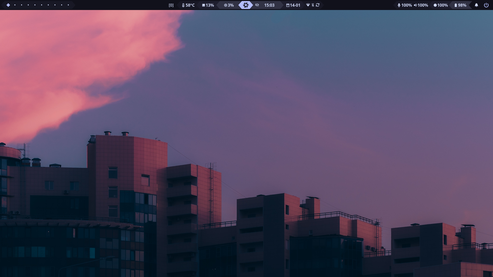
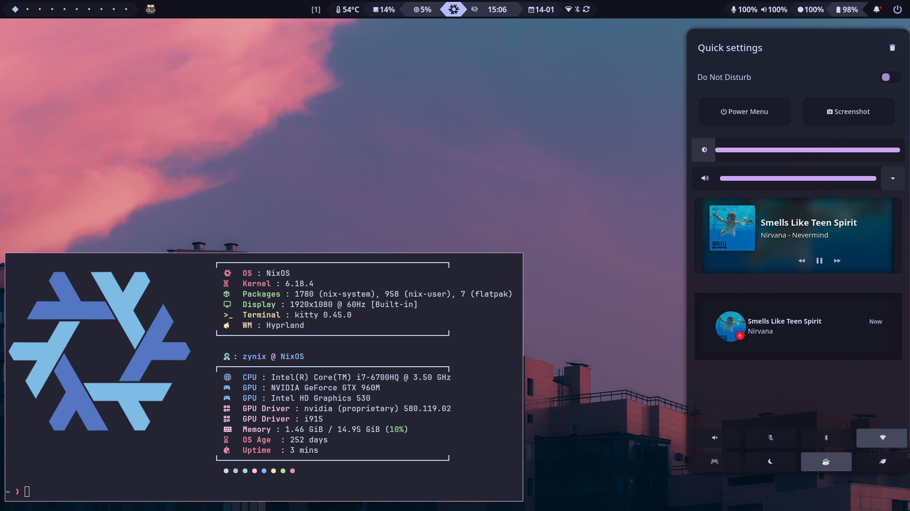
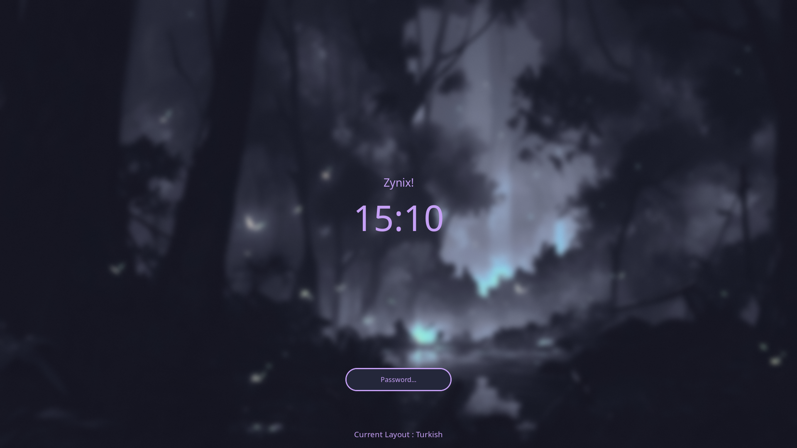

<h1 align="center">
    
   <br>
      ZyNixOS
   <br>
       <br>
   <div align="center">

   <div align="center">
      <p></p>
      <div align="center">
         <a href="https://github.com/alper-han/ZyNixOS/stargazers">
            
         </a>
         <a href="https://github.com/alper-han/ZyNixOS/network/members">
            
         </a>
         <!-- <a href="https://github.com/alper-han/ZyNixOS/"> -->
         <!--     -->
         <!-- </a> -->
         <a href="https://nixos.org">
            
            <!--  -->
         </a>
         <a href="https://github.com/alper-han/ZyNixOS/blob/main/LICENSE">
            
         </a>
      </div>
      <br>
   </div>
</h1>

<div align="center">
   
   <br>
   <br>
   
   <br>
   <br>
   
</div>


## Table of Contents

- [Installation](#installation)
  <!-- - [Before You Begin](#before-you-begin) -->
  <!-- - [Installation Steps](#installation-steps) -->
- [Usage](#usage)
  - [Managing Hosts](#managing-hosts)
  - [Rebuilding](#rebuilding)
  - [Rollbacks](#rollbacks)
  - [Keybindings](#keybindings)
- [Credits](#creditsinspiration)

## Installation

> [!Note]
> `hosts/Default` is the starter template; its `variables.nix` matches the Desktop defaults,
> except `hostname = "Default"`. Review the username and other machine-specific values.
> It intentionally has no hardware config: installers generate one for each target host.
> Do not add a generic hardware file or copy the generated file from another machine.
> `hosts/Desktop` is the personal workstation profile; do not reuse its packages or hardware.
> Review the selected host's `variables.nix`, `host-packages.nix` and `configuration.nix`.

You can install on a running system or from the NixOS live installer. Get the minimal ISO from the [NixOS website](https://nixos.org/download/#nixos-iso).

### Installation Steps

1. Clone the Repository:

```bash
git clone https://github.com/alper-han/ZyNixOS.git ~/ZyNixOS
```


2. Change Directory:

```bash
cd ~/ZyNixOS
```

3. Run the Installer:

```bash
./install.sh
```


On an installed NixOS system, `./install.sh` defaults to the matching configured
hostname; otherwise select another configured host or create one from `Default`.
Existing hardware files are preserved unless you explicitly regenerate them. On a
NixOS live ISO, it delegates to `live-install.sh`: review every selected disk,
partition, filesystem, encryption and boot choice before typing the exact device
confirmation. Automatic swap defaults to half of RAM (at least 2 GiB, no cap), or
at least RAM plus 10% when hibernation is requested; either size can be adjusted
within available disk space. UEFI installs require Secure Boot disabled.

## Usage

### Managing Hosts

**Method 1: Automatic** - run the installer again to select or create another host:

```bash
./install.sh
```

**Method 2: Manual:**

1. Copy `hosts/Default` to a new directory (e.g., `hosts/Laptop`).
2. Set `hostname = "Laptop";` in the new host's `variables.nix`, then select its
   hardware, boot mode and packages. Do not copy `hosts/Desktop/hardware-configuration.nix`.
3. Generate `hosts/Laptop/hardware-configuration.nix` on the **target** machine (or run
   the installer and select the new host). Review the generated mounts and UUIDs.
4. Stage the host directory so the Git-backed flake includes the new hardware file:
   ```bash
   git add hosts/Laptop
   ```

5. The flake discovers hosts with a staged/tracked hardware configuration automatically;
   no `flake.nix` edit is needed. Rebuild with that hostname via `nixos-rebuild` or
   `nh` (see [Rebuilding](#rebuilding) below).

### Rebuilding

Apply configuration changes:

- **Keyboard shortcut:** `Super + U`
- **rebuild script:** `rebuild`
- **nixos-rebuild:** `sudo nixos-rebuild switch --flake ~/ZyNixOS#<HOST>`
- **nh:** `nh os switch --hostname <HOST>`

Replace `<HOST>` with the name of your host (e.g., `Laptop`).

### Rollbacks

List generations:

```bash
list-gens
```

Rollback to generation N:

```bash
rollback N
```

Replace `N` with the generation number (e.g., `69`).

### Keybindings

View all keybindings with `Super + ?` or `Super + Ctrl + K`.


## Credits/Inspiration

| Credit                                                   | Reason                           |
| -------------------------------------------------------- | -------------------------------- |
| [Sly-Harvey/NixOS](https://github.com/Sly-Harvey/NixOS)  | Provided the NixOS template base |

<!-- ---

## ⭐ Star History

<details>
<summary>View Star History</summary>

<a href="https://github.com/alper-han/ZyNixOS/stargazers">
 <picture>
   <source media="(prefers-color-scheme: dark)" srcset="https://api.star-history.com/svg?repos=alper-han/ZyNixOS&type=Date&theme=dark" />
   <source media="(prefers-color-scheme: light)" srcset="https://api.star-history.com/svg?repos=alper-han/ZyNixOS&type=Date" />
   
 </picture>
</a>

</details> -->