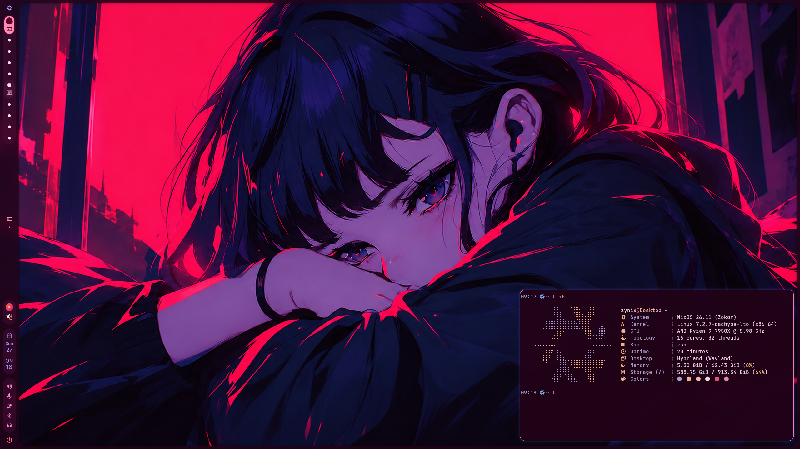
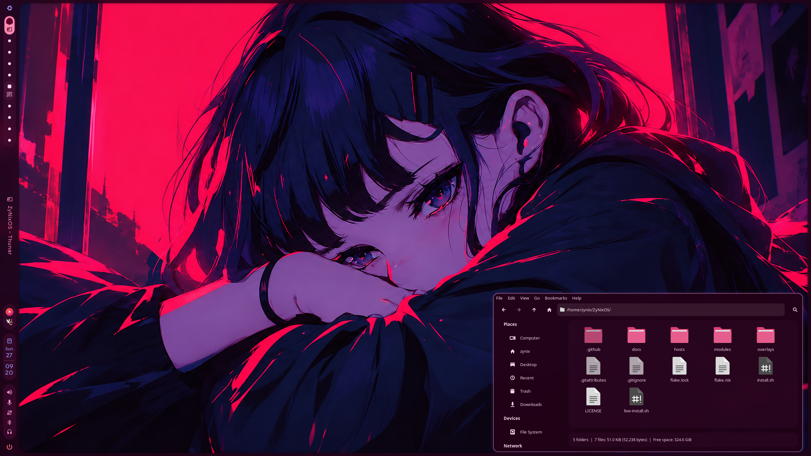
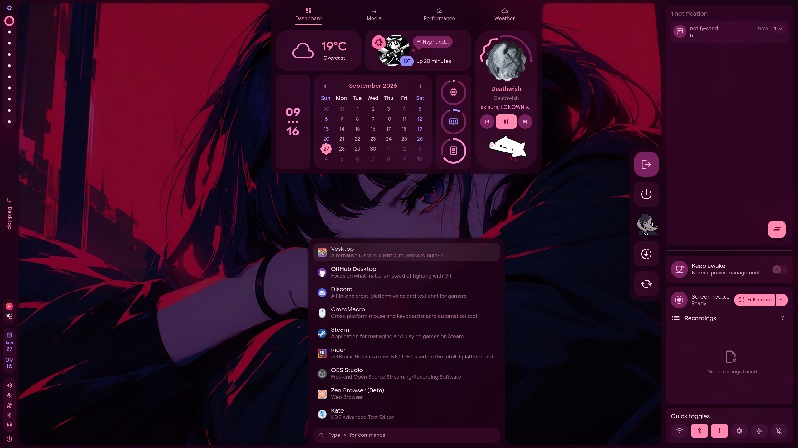
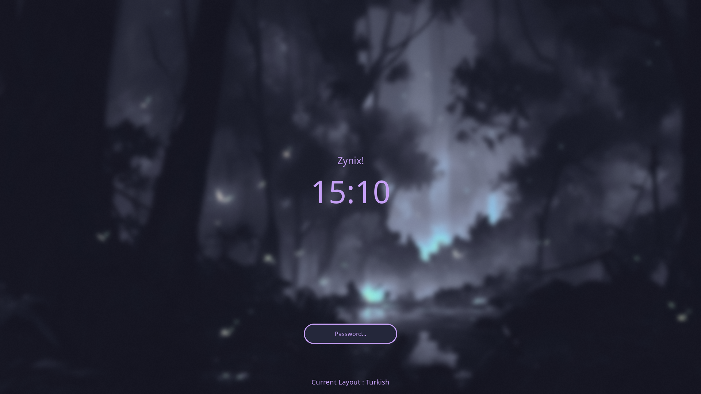

# ZyNixOS

An x86_64 NixOS flake for UEFI systems, built around Hyprland, Caelestia Shell, and Catppuccin Mocha/Mauve.

## Screenshots

<table>
  <tr>
    <td></td>
    <td></td>
  </tr>
  <tr>
    <td></td>
    <td></td>
  </tr>
</table>

<p align="center">
  
</p>

## Hosts

The flake defines `Default`, `Desktop`, and `Laptop`. `Default` is the starting point for new hosts; hardware configuration files are machine-specific and must not be reused on another machine.

## Install

```sh
git clone https://github.com/alper-han/ZyNixOS.git
cd ZyNixOS
./install.sh
```

On a NixOS live ISO, review the selected disks and partition plan before confirming; installation can erase data.

## Rebuild

On an installed system, run `rebuild` to apply its configured host. Use `list-gens` and `rollback <generation>` to manage system generations.

Based on [Sly-Harvey/NixOS](https://github.com/Sly-Harvey/NixOS) · [MIT License](LICENSE)
